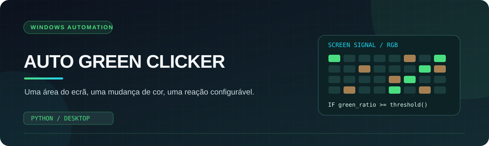
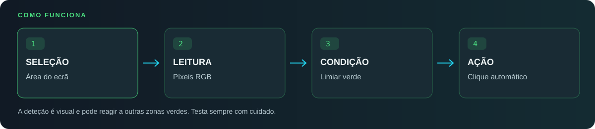

  
    
  
  
  
  <h3>Automação guiada pelo que aparece no ecrã.</h3>
  
<a href="#como-funciona">Como funciona</a> · <a href="#instalar-e-executar">Instalação</a> · <a href="#limitações">Limitações</a>

## O que desenvolvi

O **Auto Green Clicker** é uma pequena aplicação Windows que monitoriza uma ou várias áreas do ecrã e reage à transição para uma determinada proporção de píxeis verdes. Criei-o para explorar automação baseada em imagem, sem depender de uma extensão do navegador ou de uma API.

<table><tr>
<td width="50%" valign="top"><h3>01 · Seleção visual</h3>
Marco diretamente no ecrã a região que pretendo observar.
</td>
<td width="50%" valign="top"><h3>02 · Deteção RGB</h3>
O programa analisa os píxeis e calcula a percentagem de verde.
</td>
</tr><tr>
<td valign="top"><h3>03 · Sensibilidade</h3>
Posso ajustar o limiar sem alterar manualmente o código.
</td>
<td valign="top"><h3>04 · Execução local</h3>
A interface apresenta o estado de cada área e pode ficar na área de notificação do Windows.
</td>
</tr></table>

## Como funciona

O núcleo da deteção está em `is_verde()`. A função compara o canal verde com os restantes canais de cor e calcula a proporção de píxeis que passam no filtro. Quando uma área passa de um estado não detetado para detetado, a aplicação aguarda aproximadamente um segundo e executa um clique nessa região.

**Por defeito, o código inicia com um limiar de 15% de píxeis verdes.** Podes ajustar esse valor na interface. O programa não identifica semanticamente botões: reconhece cores e alterações na imagem.

## Funcionalidades presentes no código

| Recurso | Descrição |
| :--- | :--- |
| Seleção de área | Sobreposição de ecrã para desenhar um retângulo de monitorização. |
| Várias regiões | Cada área tem nome, estado e coordenadas próprios. |
| Limiar configurável | Controlo visual de sensibilidade. |
| Monitorização | Apresentação da cor média, percentagem de verde e estado observado. |
| Execução em segundo plano | Ícone na área de notificação com ações para abrir e sair. |
| Compilação local | Script `BUILD.bat` para criar o executável com PyInstaller. |

## Instalar e executar

Necessitas de **Windows e Python 3**. Na pasta do repositório, executa:

~~~powershell
python -m pip install pyautogui pillow numpy pystray
python AutoGreenClicker.py
~~~

Para gerar um executável no teu computador:

~~~powershell
python -m pip install pyinstaller
.\BUILD.bat
~~~

O script de build também instala dependências e guarda o executável gerado em `dist\AutoGreenClicker.exe` se a compilação terminar com sucesso. Não é fornecido um executável pré-compilado neste repositório.

## Estrutura

~~~text
twitchreward/
├── AutoGreenClicker.py   Interface, deteção e automação
├── BUILD.bat             Compilação para Windows
├── icon.ico              Ícone para o executável
├── assets/               Capa e diagrama
└── README.md             Documentação
~~~

## Limitações

> [!IMPORTANT]
> O clique é baseado **na cor, não no significado do elemento**. Alterações de tema, vídeo, iluminação do ecrã ou outras zonas verdes podem desencadear uma reação. Testa primeiro numa área inofensiva, acompanha os resultados e verifica as regras do serviço em que pretendes utilizar a automação.

O programa necessita de uma sessão gráfica Windows ativa. Não acede à conta Twitch e não garante que todos os estados de interface sejam reconhecidos.

## Próximas melhorias

- Melhorar a precisão da seleção do ponto de clique.
- Adicionar perfis de sensibilidade por área.
- Criar testes automatizados para a lógica de deteção.
- Documentar de forma mais completa o ciclo de arranque e paragem.

 Projeto de <a href="https://github.com/NexysT">Carlos Pereira / NexysT</a> · Automação e Python

